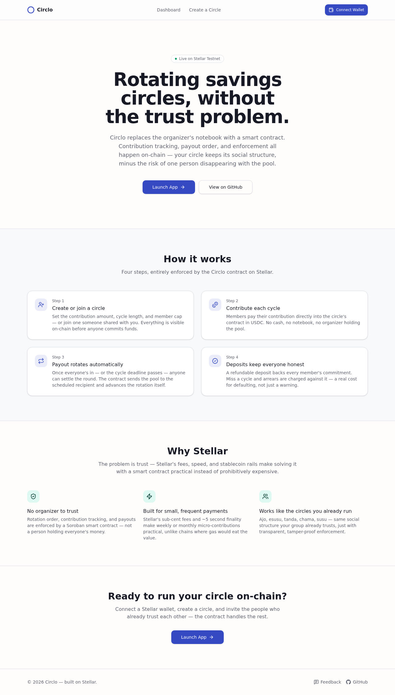
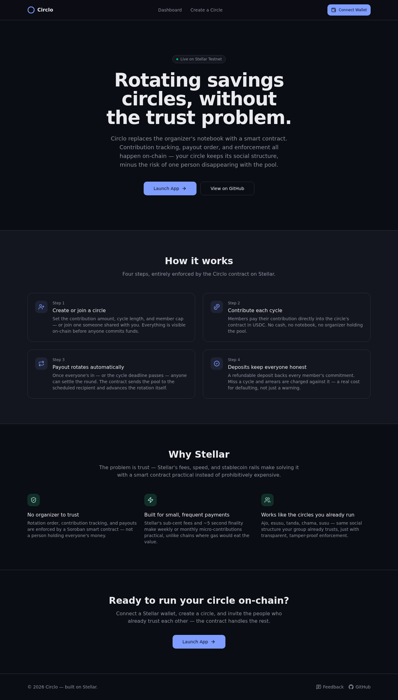
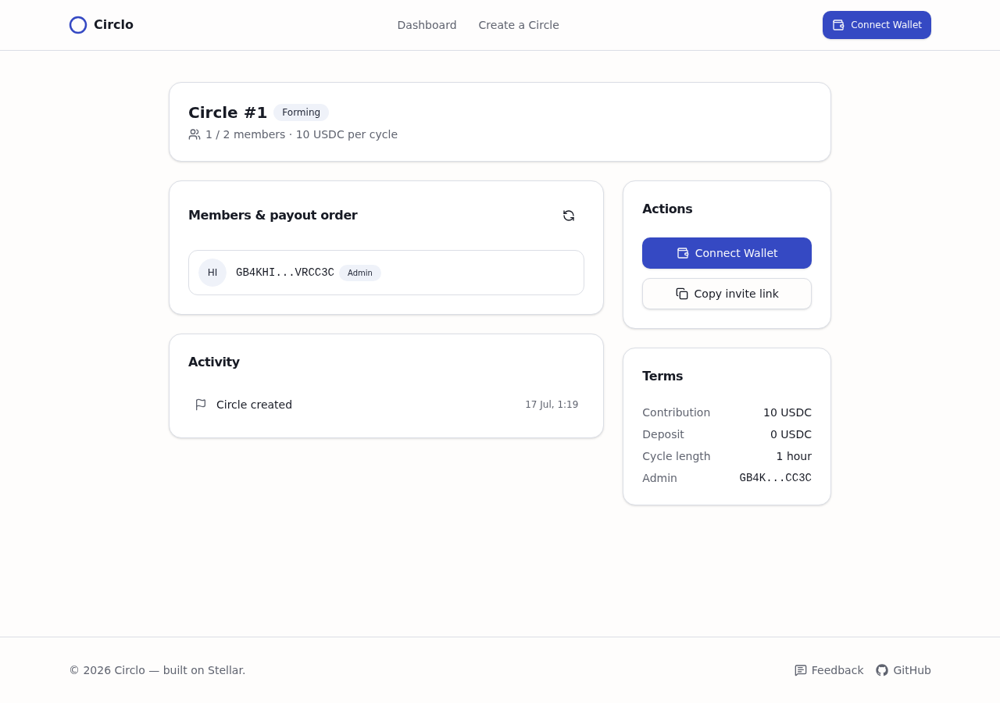
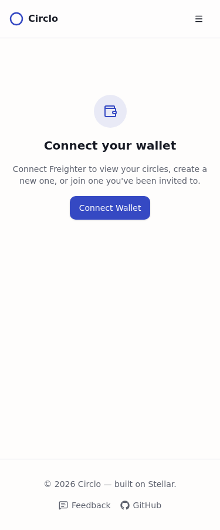
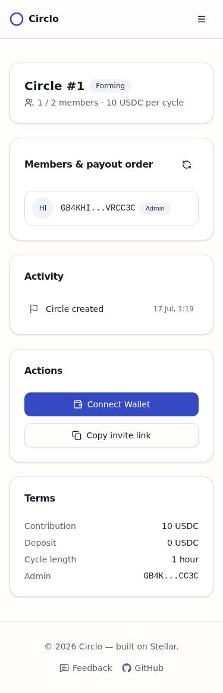

# Circlo

**Trustless rotating savings circles on Stellar.** Circlo replaces the human
organizer at the center of an *ajo / esusu / tanda / chama / susu* — the
person who collects everyone's cash, keeps a notebook, and pays out each
round — with a Soroban smart contract that enforces the same rules
transparently and without a single point of failure.

**Live demo:** [circlo-five.vercel.app](https://circlo-five.vercel.app/)
**Demo video:** [Loom walkthrough](https://www.loom.com/share/a6e2d7a7b4074fbf833060352e1a8b1d)
**Deployed contract (Stellar testnet):**
[`CC3JCXU6XMMBZDRSFLNE36DQUGIY3HQ3HAIXGFHJBF4TRQD6TFMXS53P`](https://stellar.expert/explorer/testnet/contract/CC3JCXU6XMMBZDRSFLNE36DQUGIY3HQ3HAIXGFHJBF4TRQD6TFMXS53P)
**Feedback form:** [forms.gle/DvrEyV5fqrnumpGL7](https://forms.gle/DvrEyV5fqrnumpGL7)

## Screenshots

| Landing | Landing (dark) |
| --- | --- |
|  |  |

| Circle detail | Mobile |
| --- | --- |
|  |   |

## 1. Problem

Rotating savings groups are used by hundreds of millions of people worldwide
to save and access lump sums without banks or credit checks. Today they run
entirely on trust — cash handed to an organizer, contributions tracked in a
notebook or a WhatsApp chat. That leads to missed payments, disputes over
who's next in the payout rotation, and total loss of funds if the organizer
disappears or mismanages the pool.

## 2. Why Stellar

- **Low fees, fast settlement.** Contributions are small and frequent
  (weekly/monthly); Stellar's sub-cent fees and ~5 second finality make
  micro-contributions practical where other chains would eat the value in
  gas.
- **Built-in stablecoin rails.** Using USDC on Stellar means contributors
  deal in stable value instead of a volatile asset — critical for a savings
  product.
- **Soroban smart contracts** let Circlo enforce the rotation and payout
  logic on-chain instead of trusting a human organizer — solving the exact
  core trust problem described above.

## 3. Architecture

```
                         ┌──────────────────────────┐
                         │        Frontend           │
                         │  Vite + React + TS        │
                         │  Freighter wallet          │
                         └─────────────┬─────────────┘
                                       │ typed client (packages/circlo-client)
                                       ▼
                         ┌──────────────────────────┐
                         │     Circlo contract        │
                         │   (Soroban / Rust)         │
                         │                            │
                         │  ONE contract instance      │
                         │  manages MANY circles,      │
                         │  keyed by circle_id          │
                         └─────────────┬─────────────┘
                                       │ SAC token calls (transfer)
                                       ▼
                         ┌──────────────────────────┐
                         │   USDC (Stellar Asset      │
                         │   Contract) — testnet or    │
                         │   mainnet, generic per      │
                         │   circle via `token: Address`│
                         └──────────────────────────┘
```

A single contract deployment manages every circle via composite storage
keys — there's no per-group contract deployment. See
[`contracts/circlo`](contracts/circlo) for the full implementation.

### Data flow

1. A user connects Freighter and calls `create_circle` (becomes its admin
   and first member).
2. Others `join_circle` while it's still `Created`, each paying the
   refundable deposit if one is configured.
3. The admin calls `start_circle` once ≥2 members have joined. Membership
   and payout order are frozen from this point on.
4. Every member calls `contribute` each cycle, paying directly into the
   contract's own token balance.
5. **Anyone** — a member, a keeper script, a cron job — can call
   `trigger_payout` once the cycle is complete or its deadline has passed.
   The contract sends the pool to that cycle's scheduled recipient and
   rotates to the next cycle itself. No human decides when or who gets
   paid.

## 4. Smart contract design

### Why a single contract for many circles

`contracts/circlo/src/storage.rs` keys every piece of per-circle state
independently (`Circle(id)`, `PayoutOrder(id)`, `Contribution(id, cycle,
member)`, `Deposit(id, member)`, `Arrears(id, member)`, ...) instead of one
growing struct per circle. That means `contribute()` never has to read or
rewrite a circle's full member list — it only touches the two small entries
that actually changed, so the contract scales to many concurrent circles of
different sizes without any one call getting more expensive as a circle
grows.

### The fallback/penalty mechanism

The brief calls for handling a missed contribution "without breaking the
group's trust model — needs a fallback/penalty mechanism, not just a
revert." Circlo's answer:

- Every member pays a **refundable deposit** at `join_circle`.
- `trigger_payout` pays the scheduled recipient whatever was **actually
  collected** that cycle (the full pool on the happy path, a partial pool
  if someone missed the deadline) — it never reverts into a stuck state,
  and an empty cycle just advances with a `CycleSkipped` event instead of a
  zero-amount transfer.
- Every member who missed the deadline is charged **arrears** against their
  deposit and **demoted** to the back of the remaining rotation.
- Once the circle completes, each member pulls their own refund via
  `claim_deposit`: `max(0, deposit - arrears)`.

This gives the penalty real economic weight — a chronic defaulter forfeits
collateral, not just a "strike" — while never blocking the circle from
progressing.

### Preventing manipulation

- No `withdraw` function exists. Funds only ever leave the contract via
  `trigger_payout`, to the address the rotation itself determines.
- `join_circle` only works while `status == Created`; once `start_circle`
  runs, membership and payout order are frozen (aside from the in-place
  demotion described above, which only reorders the *not-yet-paid* tail).
- `trigger_payout` is intentionally **permissionless** — no admin, no
  off-chain arbiter decides when a cycle settles or who receives it.

### Function reference

| Function | Who | What |
| --- | --- | --- |
| `create_circle(admin, token, contribution_amount, deposit_amount, cycle_interval, max_members)` | admin | Creates a circle, admin joins as member 0. |
| `join_circle(circle_id, member)` | anyone, pre-start | Joins while `Created`; pays the deposit if any. |
| `start_circle(circle_id, admin)` | admin | Freezes membership, starts cycle 1. |
| `contribute(circle_id, member)` | member | Pays this cycle's contribution. |
| `check_cycle_complete(circle_id)` | anyone (view) | Has everyone paid in this cycle? |
| `trigger_payout(circle_id)` | **anyone** | Settles the cycle once ready; happy-path or deadline-fallback. |
| `claim_deposit(circle_id, member)` | member, post-completion | Pulls `deposit - arrears`. |
| `get_status(circle_id)` | anyone (view) | Full circle state for the frontend. |
| `get_my_circles(member)` | anyone (view) | Circle ids a member has ever joined. |

Full error and event definitions live in
[`errors.rs`](contracts/circlo/src/errors.rs) and
[`events.rs`](contracts/circlo/src/events.rs) — the events double as the
on-chain activity feed the frontend renders per circle, with no separate
indexer.

### Complexity this design had to handle

1. Tamper-proof rotation order, no double-payouts, no early withdrawal —
   enforced purely in contract logic, checks-effects-interactions ordering
   throughout `trigger_payout`.
2. Partial-cycle states (a missed contribution) handled via the
   deposit/arrears/demotion mechanism above, not a revert.
3. One contract managing many concurrent circles of different sizes,
   amounts, and cycle lengths — via the composite storage-key layout, not
   per-group contract deployments.
4. Membership/payout-order manipulation prevented after start, while still
   flexible pre-start.

### Future work

The current penalty model forfeits a defaulter's deposit to the contract
rather than redistributing it to the members whose payout it shorted.
Splitting the forfeited deposit pro-rata among the affected cycle's
contributors would close that gap — left out of this MVP to keep the
storage/accounting surface small enough to review and test thoroughly in
the time available.

## 5. Repository layout

```
Circlo/
├── contracts/circlo/     Soroban contract (Rust)
├── packages/circlo-client/  Generated TypeScript client (stellar contract bindings typescript)
├── frontend/             Vite + React + TypeScript app
├── scripts/deploy-testnet.sh  Reproducible build/deploy/bindings pipeline
└── .github/workflows/ci.yml   Contract tests + frontend build on every push/PR
```

## 6. Local development

### Prerequisites

- Rust with the `wasm32v1-none` target (`rustup target add wasm32v1-none`)
- [`stellar` CLI](https://developers.stellar.org/docs/tools/cli) v25+
- Node.js 22+

### Contract

```bash
cargo test -p circlo          # unit test suite (lifecycle + negative paths)
cargo clippy -p circlo --all-targets
stellar contract build
```

### Frontend

```bash
npm install                    # from the repo root — npm workspaces
npm run build                  # builds packages/circlo-client, then the frontend
npm run dev                    # start the Vite dev server
```

The frontend is already pointed at the deployed testnet contract via
[`frontend/src/config.ts`](frontend/src/config.ts) — no local deployment is
required to run it.

## 7. Testnet deployment

The contract is already deployed (see the address at the top of this file).
To redeploy from scratch:

```bash
./scripts/deploy-testnet.sh [deployer-identity-name]
```

This builds the contract, deploys it to Stellar testnet, generates fresh
TypeScript bindings into `packages/circlo-client`, and prints the new
contract id. Update `frontend/src/config.ts` with it afterwards.

### Getting testnet USDC

Circlo points at Circle's public testnet USDC
(`CBIELTK6YBZJU5UP2WWQEUCYKLPU6AUNZ2BQ4WWFEIE3USCIHMXQDAMA`, wrapping the
classic asset issued by `GBBD47IF6LWK7P7MDEVSCWR7DPUWV3NY3DTQEVFL4NAT4AQH3ZLLFLA5`)
rather than a custom test token, so the demo reflects the real integration.
To get test funds:

1. Fund a testnet account with XLM via
   [Friendbot](https://friendbot.stellar.org).
2. Establish a USDC trustline (`changeTrust`) on that account. In Freighter:
   switch the network to **Testnet**, open **Manage Assets → Add asset**,
   and add it manually with asset code `USDC` and issuer
   `GBBD47IF6LWK7P7MDEVSCWR7DPUWV3NY3DTQEVFL4NAT4AQH3ZLLFLA5` (it won't show
   up in the searchable directory, which only indexes mainnet assets). See
   also [Circle's quickstart](https://developers.circle.com/stablecoins/quickstart-setup-usdc-trustline-stellar).
3. **Only after** the trustline exists, request USDC at
   [faucet.circle.com](https://faucet.circle.com) (20 USDC per address per
   network every 2 hours) — the faucet cannot create the trustline for you,
   it can only fund one that already exists.

## 8. Production deployment

The frontend is live on Vercel at **[circlo-five.vercel.app](https://circlo-five.vercel.app/)**.
To redeploy: import this repository at [vercel.com](https://vercel.com/new),
set the project root directory to `frontend`, and deploy — no environment
variables are required, since the testnet contract id and RPC endpoint are
checked into `config.ts` by design (this is a public testnet contract, not
a secret).

## 9. Feedback

We collected feedback from the testnet cohort via the
**["Feedback" link](https://forms.gle/DvrEyV5fqrnumpGL7)** in the app's
footer (a Google Form) — see `FEEDBACK_FORM_URL` in
[`frontend/src/config.ts`](frontend/src/config.ts). Full raw responses are
in [this spreadsheet](https://docs.google.com/spreadsheets/d/1iywgRI2UVUCP-MnDdnMVbQG9tDKBUwyJC7yVnO4PuP4/edit?usp=sharing).

### Summary (9 responses so far)

- **4.9 / 5 average rating** (eight 5s, one 4); all 9 said they'd recommend
  Circlo to others.
- **No bugs reported** by any respondent — several explicitly called the
  flow "seamless" / "smooth."
- **Most-liked:** the simplicity of the UI, the activity feed (seeing
  exactly when someone joined/contributed/a circle was created), the
  payout-order visibility, and the trustline error message being caught
  and explained clearly instead of failing silently.
- **Most requested:**
  - A discovery page to browse/join public circles instead of only by ID.
  - A dispute-raising mechanism for members.
  - Two respondents asked for "contributor-triggered payout" / "payout
    without admin approval" — `trigger_payout` is already permissionless
    (any member can call it once a cycle is ready), so this reads as a UI
    clarity gap rather than a missing feature: the action isn't
    communicated as available to non-admins clearly enough.
  - "Sign in with Google" — not applicable given the non-custodial wallet
    model, but signals some users expected a more familiar auth pattern.

## License

MIT — see [LICENSE](LICENSE).
